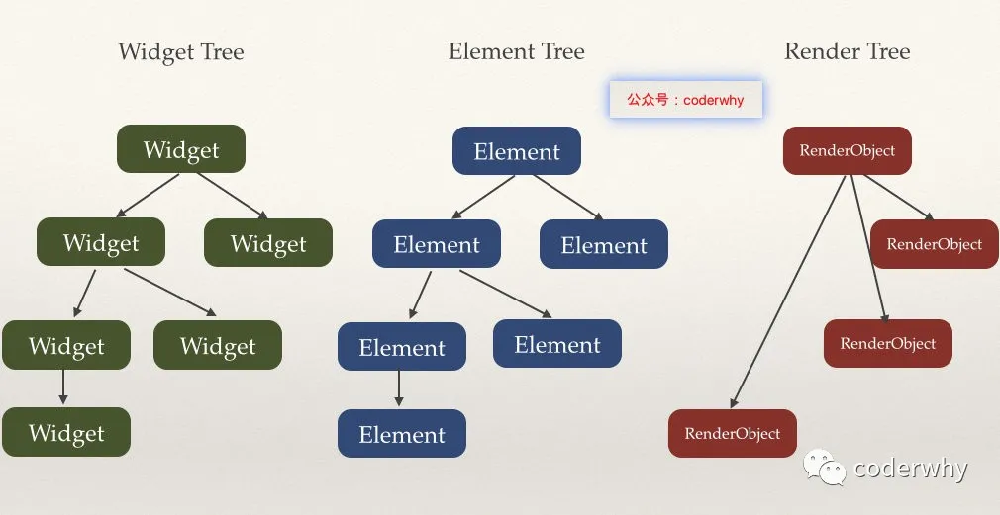

# Flutter原理

- Element持有_wdiget，指向Widget Tree对应的Widget
- Element持有_renderObject，指向右边Render Tree对应的Render
- Element(statefullElement)持有_state = widget.createState()
- 每一个Widget都有一个Element
- BuildContext context就是Widget对应的Element
- GC:垃圾回收器


## RenderObjectWidget
```dart
 @protected
  RenderObject createRenderObject(BuildContext context);
```

## 知识点
- 所有的Widget都会创建一个element

## 渲染原理
### 自己写Widget  
### 某些Widget中会创建RenderObject  
### 每一个Widget都会创建一个Element对象  
### Element
- ComponentElement
- RenderObjectElement
- StatefulElement
### ComponentElement的mount
```dart
   @override
  void mount(Element parent, dynamic newSlot) {
    super.mount(parent, newSlot);
    assert(_child == null);
    assert(_active);
    _firstBuild();
    assert(_child != null);
  }
```
>  ComponentElement主要流程： mount()->_firstBuild()->rebuild()->performRebuild() -> build()->_widget.build() 

ComponentElement的build源码:
```dart
@override
  Widget build() => widget.build(this);
```

### RenderObjectElement的mount
```dart
@override
  void mount(Element parent, dynamic newSlot) {
    super.mount(parent, newSlot);
    _renderObject = widget.createRenderObject(this);
    assert(() {
      _debugUpdateRenderObjectOwner();
      return true;
    }());
    assert(_slot == newSlot);
    attachRenderObject(newSlot);
    _dirty = false;
  }
```
 
> RenderObjectElement主要流程：mount()->_widget.createRenderObject(this)

ComponentElement和RenderObjectElement的mount方法最主要的区别：
- ComponentElement的mount主要是调用Build方法，区构建跟多的东西
- RenderObjectElement最主要的是调用createRenderObject，创建RenderObject
###  StatefulElement的mount
- 构造方法->widget.createState()->state._widget = widget
- StatefulElement中的build的源码
  ```dart
   Widget build() => state.build(this);
  ```

## 调度安排
为了让RG最小化对App和UI性能的影响，GC对Flutter引擎提供了hooks(钩子)，hooks被通知，当Flutter引擎被侦测到这个App处于闲置的状态，并且没有用户交互的时候。这就给了GC一个空窗期来运行它的手机阶段，并且不会影响性能。

垃圾收集器还可以在那些空闲间隔内进行滑动压缩（sliding compaction），从而通过减少内存碎片来最大程度地减少内存开销

## BuildContext其实就是Element
```dart
 @override
  Widget build(BuildContext context) {
    return Scaffold(
    );
  }
```

## V8引擎
VSCode是用typescript写的，转成js代码，然后使用v8引擎解析js代码，v8的垃圾回收机制和Dart的一样

## 总结
1. 每个Widget都会创建一个Element
1. Element会去调用mount方法
- ComponentElement的mount方法会调用Widget的build
- RenderObjectElement的mount方法创建一个RenderObject（生成一个_renderObject，并引用这个RenderObject；
- StatefulElement的mount方法会创建state = createState()方法，state._widget = widget
