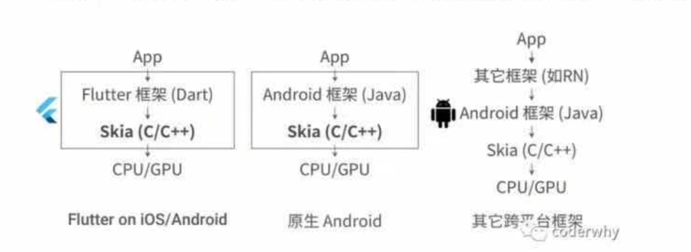
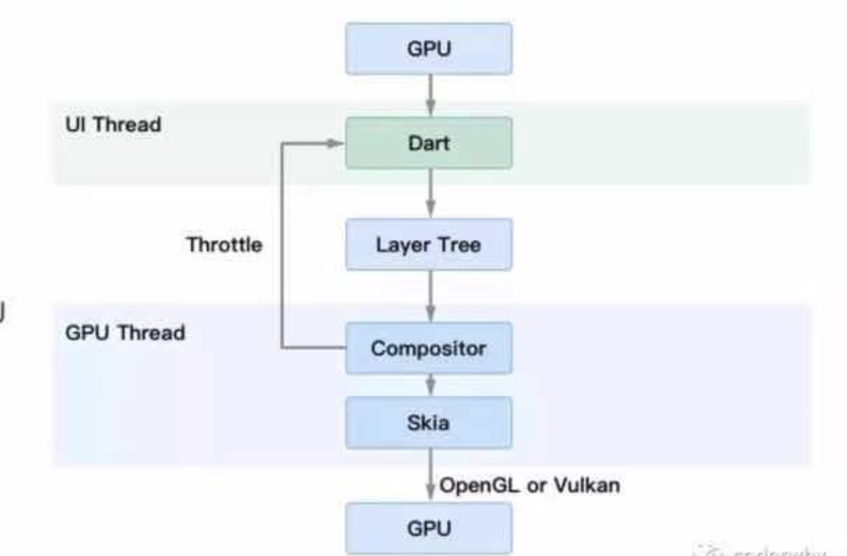

# Recognize
## React Native
### RN简介:
- RN是Facebook于2015年4月开源的跨平台移动应用开发框架，是Facebook早先开源的JS框架React在原生移动平台的衍生产物
- RN使用JavaScript语言，类似于HTML的JSX，以及CSS来开发移动应用
- 保留基本渲染能力的基础上，用原生自带的UI组件实现核心的渲染引擎，从而保证良好的渲染性能
- 但是由于RN的本质是通过JavaScript VM调用原生接口，通信相对比较低效，而且框架本身不负责渲染，而是间接通过原生进行渲染
### RN技术架构
## Flutter
### Flutter简介
- Flutter利用Skia绘图引擎，直接通过CPU、GPU进行绘制，不需要依赖任何原生的控件
- Android操作系统中，我们编写的原生控件实际上也是依赖于Skia进行绘制，所以flutter在某些Android操作系统上甚至还要高于原生(因为原生Android中的Skia必须随着操作系统进行更新，而FlutterSDK中总是保持最新的)
- 而类似于RN的框架，必须通过某些桥接的方式先转成原生进行调用，之后再进行渲染。

### Flutter绘制原理图
- GPU将信号同步到UI线程
- UI线程用Dart来构建图层树
- 图层树在GPU 线程进行合成
- 合成后的视图数据提供给Skia引擎 
- Skia引擎通过OpenGL或者 Vulkan将显示内容提供给GPU

>⚠️：这也是Flutter区别于RN的本质区别
> - RN之类的框架，只是通过JavaScript虚拟机扩展调用系统组件，由Android和iOS系统进行组件的渲染
> - Flutter是自己完成了组件渲染的闭环

### 帧率和刷新率的关系
-  CPU/GPU向Buffer 中生成图像，屏幕从 Buffer 中取图像、刷新后显示。
   - 这是一个典型的生产者--消费者模型。
   - 理想的情况是帧率和刷新频率相等，每绘制一帧，屏幕显示一帧
-  但是实际往往它们的大小是不同的。
   - 如果没有锁来控制同步，很容易出现问题。
   - 例如，当帧率大于刷新频率，当屏幕还没有刷新第n-1帧的时候，GPU已经在生成第帧了
   - 从上往下开始覆盖第n-1帧的数据，当屏幕开始刷新第 n-1帧的时候，Buffer中的数据上半部分是第帧数据而下半部分是第n-1帧的数据
   - 显示出来的图像就会出现上半部分和下半部分明显偏差的现象，我们称之为“tearing”(撕裂)

## 双重缓存(Double Buffer)
### 为了解决单缓存的"tearing”问题，就出现了双重缓存和 VSync;
- 两个缓存区分别为 Back Buffer 和 Frame Buffer.
- GPU向BackBuffer中写数据，屏幕从Frame Buffer中读数据。 VSync信号负责调度从Back Buffer 到 Frame Buffer的复制操作
- 当然底层不是通过复制，而是通过交换内存地址方式，所以可以瞬间完成，效率是非常高的;

### 工程流程:
- 在某个时间点，一个屏幕刷新周期完成，VSync信号产生，先完成
复制操作，然后通知 CPU/GPU 绘制下一帧图像。
- 复制操作完成后屏幕开始下一个刷新周期，即将刚复制到Frame Buffer的数据显示到屏幕上。
### 存在的问题:
- 双重缓存的缺陷在于:当CPU/GPU绘制一帧的时间过长(比如超过
 Parallel Processing and Double Buffering
16ms)时，会产生Jank(画面停顿，甚至空白)。
  - 蓝色代表 CPU 生成 Display List;
  - 绿色代表 GPU执行 Display List 中的命令从而生成帧;  GP
  - 黄色代表生成帧完成，在屏幕上显示
- 双缓存模型中:
  - CPU生成蓝色B的数据，由GPU进行B的绘制，但是这个过长由于过长，那么第二个A就产生了Jank。"
  - B在屏幕上显示之后，发出Vsync信号，A开始绘制，但是由于绘制时间过长，第二个B位置又产生了Jank

## 三重缓存(TripleBuffer)了解
### 如何解决双重缓存的问题了?  
- 在第二个A展示，Vsync信号发出后，直接绘制C Buffer口在第一个B展示，Vsync信号发出后，绘制A Buffer
- 因为C已经在缓存中，可以直接从缓存中取出C Buff来进行展示，依次类推  
### 其实本质是在每次Vsync信号发出后，多缓存一个Buffer作为备用

### 根据三重缓存的原理再看Flutter绘制原理图

## Flutter的特点
Google公司在国内做过很多宣讲，其中多次提到Flutter的几个特点:美观、快速、高效、开放。
- 美观
  - 使用Futter内置美丽的Material Desig和Cupertino wigt(什么widgt不着急)、丰富的motion APL. 平清而自然的滑动效果和平台感知，为您的用户带来全新体验。
- 快速
  - Flutter 的 UI 渲染性能很好。在生产环境下，Flutter 将代码编译成机器码执行，并充分利用 GPU 的图形加速能力，因此使用Flutter 快速开发的移动应用即使在低配手机上也能实现每秒 60 帧的 UI 渲染速度。
  - Flutter 引擎使用 C++编写，包括高效的 Skia 2D 渲染引擎，Dart 运行时和文本渲染库。
- 高效
  - Hot Reload (热重载)，在前端已经不是什么新鲜的东西，但在移动端之前一直是没有的高效:
- 开放:
  - Flutter 是开放的，它是一个完全开源的项目。

## Flutter渲染引擎skia
- Skia就是Flutter向GPU提供数据的途径。
  - Skia(全称Skia Graphics Library( SGL))是一个由C++编写的开源图形库口能在低端设备如手机上呈现高质量的2D图形，最初由Skia公司开发，后被 Google收购
  - 应用于Android、 Google Chrome、 Chrome OS等等当中。
- 目前，Skia已然是Android 官方的图像渲染引擎了，因此 Flutter Android SDK无需内嵌Skia 引擎就可以获得天然的 Skia 支持;
- 而对于iOS平台来说，由于Skia 是跨平台的，因此它作为 Flutter iOS 渲染引擎被嵌入到 Flutter 的 iOS SDK 中，替代了iOS 闭源的 Core Graphics/Core Animation/Core Text，这也正是Flutter iOS SDK 打包的 App 包体积比 Android 要大一些的原因。
- 底层渲染能力统一了，上层开发接口和功能体验也就随即统一了，开发者再也不用操心平台相关的渲染特性了。也就是说，Skia 保证了同一套代码调用在 Android和iOS平台上的渲染效果是完全一致的。

