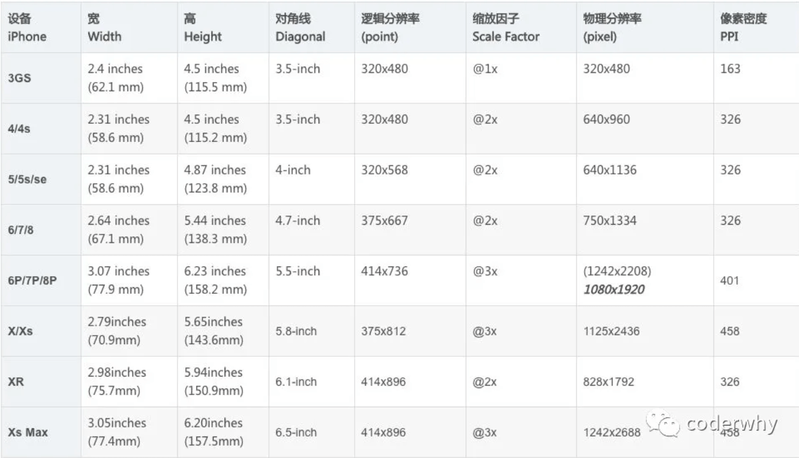

# 屏幕适配

Flutter使用的是类似于iOS中的点pt，也就是point  
在Flutter开发中，我们使用的是对应的逻辑分辨率

```dart
  // 1. 获取手机的物理分辨率
    double physicalWidth = window.physicalSize.width;
    double physicalHeight = window.physicalSize.height;

    // 2. 获取dpr
    dpr = window.devicePixelRatio;

    // 3. 宽度和高度
    screenWidth = physicalWidth / dpr;
    screenHeight = physicalHeight / dpr;

    // 4.状态栏的高度
    statusHeight = window.padding.top / dpr;

    // 5.计算rpx的大小
    rpx = screenWidth / 750;
    px = rpx * 2;
```

## 使用extension来添加rpx和px，进行屏幕适配
extension，需要Dart version >= 2.6.0

