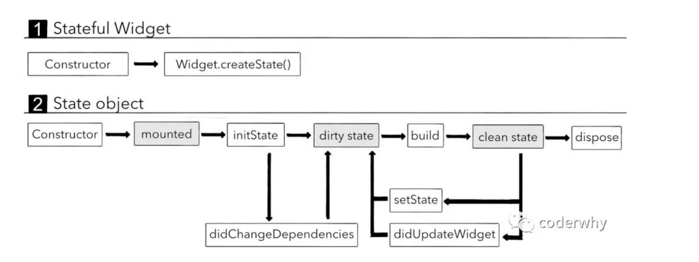

# 部件
## Widget
### 万物皆是widget
 
### build方法的解析
- Flutter在拿到我们自己创建的StatelessWidget时，就会被执行它的build方法
- 我们需要在build方法中告诉Flutter，我们的Widget希望渲染什么元素，比如Text
- StatelessWidget没办法主动去执行build方法，当我们使用的数据发生改变时，build方法会被重新执行 
### build方法在什么情况下被执行呢？
- StatelessWidget第一次被插入到Widget树中时（也就是第一次被创建时）
- 当我们的父Widget（parent widget）发生改变时，子Widget会被重新构建
- 如果我们的Widget依赖InheritedWidget的一些数据，InheritedWidget数据发生改变时


## 生命周期
### StatelessWidget的生命周期
1. 构造函数
1. build函数
### StatefulWidget的生命周期
- 在下图中，灰色部分的内容是Flutter内部操作的，我们并不需要手动去设置它们；
- 白色部分表示我们可以去监听到或者可以手动调用的方法；


- mounted是State内部设置的一个属性
- dirty state的含义是脏的State,它实际是通过一个Element的东西（我们还没有讲到Flutter绘制原理）的属性来标记的；将它标记为dirty会等待下一次的重绘检查，强制调用build方法来构建我们的Widget；
- clean state的含义是干净的State,它表示当前build出来的Widget，下一次重绘检查时不需要重新build；

 
## 细微知识点
- 形成的是一个Widget树，类似于组件化开发
- material：是一套设计风格
- @requeired : 必须的，注解告诉我某些命名可选参数是必传的
- @immutable : 不可变的注解，里面所有的东西都必须是final的
- StatefulWidget：可变的Widget 
- StatelessWidget：不可变的Widget
- android/iOS命名式编程器，没有状态的概念，只说属性和数据；vue\react\angular声明式编程（管理好状态）；Flutter开发中，所有的Widget都不能定义状态
- Scaffold : 相当于UIViewController或者Activity
- 快速创建一个statelessWidget
  > 快捷方式: stl(根据代码提示)
- 快速创建新的Widget包裹一个Widget：光标确定到那个位置，option+回车即可
- 快速查看一个类的子类，光标移动到这个类，然后commond + option + B
- State加_:状态这个类只是给Widget使用
  ```dart
  class _DSContentState extends State<DSContentBody>{
    @override
    Widget build(BuildContext context) {
       // TODO: implement build
       return null;
      }
  }
  ```
- StateFulWidget的build方法放在State中
  - build出来的Widget是需要依赖State中的变量(状态/数据)
  - 在Flutter的运行过程中:
    - Widget是不断的销毁和创建的
    - 当我们自己的状态发生改变时，并不希望重新状态一个新的State

- 将已经存在的StatelessWidget转换成一个StatefulWidget : 直接使用快捷键：将光标放在StatelessWidget名字，然后直接[option + 回车]即可看到转换的入口
- 将已经build的一个Widget抽取成一个class，快捷键：将光标放在Widget上面，然后直接【option+回车+w】即可

## 刷新界面setState方法的源代码
```dart
  @protected
  void setState(VoidCallback fn) {
    assert(fn != null);
    assert(() {
      if (_debugLifecycleState == _StateLifecycle.defunct) {
        throw FlutterError.fromParts(<DiagnosticsNode>[
          ErrorSummary('setState() called after dispose(): $this'),
          ErrorDescription(
            'This error happens if you call setState() on a State object for a widget that '
            'no longer appears in the widget tree (e.g., whose parent widget no longer '
            'includes the widget in its build). This error can occur when code calls '
            'setState() from a timer or an animation callback.'
          ),
          ErrorHint(
            'The preferred solution is '
            'to cancel the timer or stop listening to the animation in the dispose() '
            'callback. Another solution is to check the "mounted" property of this '
            'object before calling setState() to ensure the object is still in the '
            'tree.'
          ),
          ErrorHint(
            'This error might indicate a memory leak if setState() is being called '
            'because another object is retaining a reference to this State object '
            'after it has been removed from the tree. To avoid memory leaks, '
            'consider breaking the reference to this object during dispose().'
          ),
        ]);
      }
      if (_debugLifecycleState == _StateLifecycle.created && !mounted) {
        throw FlutterError.fromParts(<DiagnosticsNode>[
          ErrorSummary('setState() called in constructor: $this'),
          ErrorHint(
            'This happens when you call setState() on a State object for a widget that '
            'hasn\'t been inserted into the widget tree yet. It is not necessary to call '
            'setState() in the constructor, since the state is already assumed to be dirty '
            'when it is initially created.'
          ),
        ]);
      }
      return true;
    }());
    final dynamic result = fn() as dynamic;
    assert(() {
      if (result is Future) {
        throw FlutterError.fromParts(<DiagnosticsNode>[
          ErrorSummary('setState() callback argument returned a Future.'),
          ErrorDescription(
            'The setState() method on $this was called with a closure or method that '
            'returned a Future. Maybe it is marked as "async".'
          ),
          ErrorHint(
            'Instead of performing asynchronous work inside a call to setState(), first '
            'execute the work (without updating the widget state), and then synchronously '
           'update the state inside a call to setState().'
          ),
        ]);
      }
      // We ignore other types of return values so that you can do things like:
      //   setState(() => x = 3);
      return true;
    }());
    //刷新界面的原理
    _element.markNeedsBuild();
  }
```