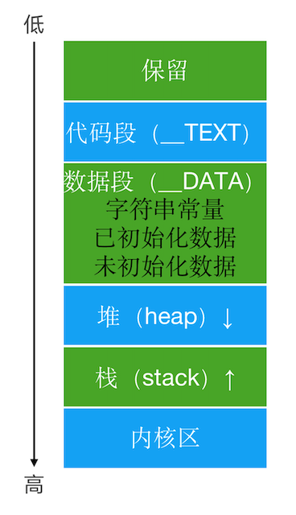
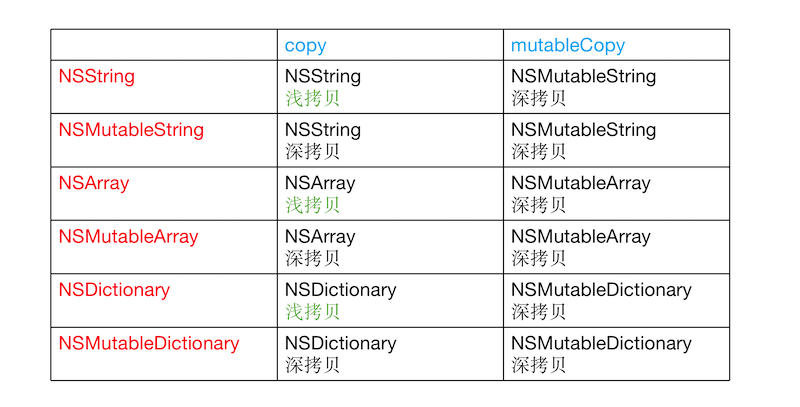
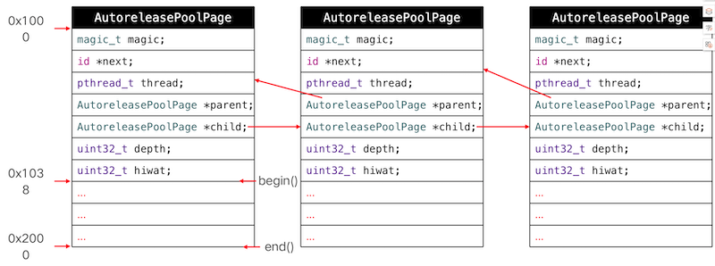

# 内存管理
## CADisplayLink、NSTimer 
### CADisplayLink、NSTimer会对target产生强引用，如果target又对它们产生强引用，那么就会引发循环引用
### 解决方案
- 使用block
```objc
__weak typeof(self) weakSelf = self;
self.timer = [NSTimer scheduledTimerWithTimeInterval:1.0 repeats:YES block:^(NSTimer * _Nonnull timer) {
       [weakSelf timerTest];  
}];
```
- 使用代理对象(NSProxy)
```objc
 self.timer = [NSTimer scheduledTimerWithTimeInterval:1.0 target:[MJProxy proxyWithTarget:self] selector:@selector(timerTest) userInfo:nil repeats:YES];
```
```objc
@interface MJProxy : NSProxy
+ (instancetype)proxyWithTarget:(id)target;
@property (weak, nonatomic) id target;
@end

@implementation MJProxy

+ (instancetype)proxyWithTarget:(id)target
{
    // NSProxy对象不需要调用init，因为它本来就没有init方法
    MJProxy *proxy = [MJProxy alloc];
    proxy.target = target;
    return proxy;
}
// 消息转发机制
- (NSMethodSignature *)methodSignatureForSelector:(SEL)sel
{
    return [self.target methodSignatureForSelector:sel];
}

- (void)forwardInvocation:(NSInvocation *)invocation
{
    [invocation invokeWithTarget:self.target];
}
@end
```
### CADisplayLink和NSTimer是基于RunLoop的，可能会存在不准时的情况 
## NSProxy
### 消息转发类，和NSObject同级别
```objc
// NSProxy中的isKindOfClass源码实现
- (BOOL) isKindOfClass: (Class)aClass
{
  NSMethodSignature	*sig;
  NSInvocation		*inv;
  BOOL			ret;

  sig = [self methodSignatureForSelector: _cmd];
  inv = [NSInvocation invocationWithMethodSignature: sig];
  [inv setSelector: _cmd];
  [inv setArgument: &aClass atIndex: 2];
  [self forwardInvocation: inv];
  [inv getReturnValue: &ret];
  return ret;
}
```
## GCD定时器
```objc
import UIKit
var ds_timers:[String:DispatchSourceTimer] = [:]

@objc public class DS_Timer: NSObject {
    //MARK:- 定时器执行任务
    @objc class func execTask(task:(()->())?,start:TimeInterval,interval:TimeInterval,repeats:Bool,async:Bool)->String?{
        if task == nil || start < 0 || (repeats && interval <= 0) {
            return nil
        }
        //队列
        let queue = async ? DispatchQueue.global() : DispatchQueue.main
        //创建定时器
        /**创建timer
         * flags: 一个数组，（暂时不知干吗用的，请大神指教）
         * queue: timer 在那个队列里面执行
         */
        let timer = DispatchSource.makeTimerSource(flags: [], queue:queue)
        
        if repeats{
            ///设置timer的计时参数
            /**
             wallDeadline: 什么时候开始
             leeway: 调用频率,即多久调用一次
             */
            //循环执行，马上开始，间隔为1s,误差允许10微秒
            timer.schedule(deadline: DispatchTime.now() + start, repeating: interval, leeway: .milliseconds(10))
        }else{
            //执行一次
            timer.schedule(deadline: DispatchTime.now() + start, leeway: .milliseconds(10))
        }
        
        //线程锁
        objc_sync_enter(ds_timers)
        let timerKey = String(format: "%d", ds_timers.count)
        ds_timers[timerKey] = timer
        objc_sync_exit(ds_timers)
        
        
        ///执行timer
        timer.setEventHandler(handler: { 
            task?()
            if !repeats{
                DS_Timer.cancelTask(timerKey)
            }
        })
        ///执行timer
        timer.resume()
        
        return timerKey
    }
    
    //MARK:- 取消任务
    @objc class func cancelTask(_ timerKey:String?){
        guard let key = timerKey else {
            return
        }
        objc_sync_enter(ds_timers)
        guard let timer = ds_timers[key] else {
            return
        }
        timer.cancel()
        ds_timers.removeValue(forKey: key)
        objc_sync_exit(ds_timers)
    }
}
```
## iOS程序的内存布局
### 代码段：编译之后的代码
### 数据段
- 字符串常量：比如NSString *str = @"123"
- 已初始化数据：已初始化的全局变量、静态变量等
- 未初始化数据：未初始化的全局变量、静态变量等
### 堆：通过alloc、malloc、calloc等动态分配的空间，分配的内存空间地址越来越大
### 栈：函数调用开销，比如局部变量。分配的内存空间地址越来越小，现分配的越大


## Tagged Pointer
- 从64bit开始，iOS引入了Tagged Pointer技术，用于优化NSNumber、NSDate、NSString等小对象的存储

- 在没有使用Tagged Pointer之前， NSNumber等对象需要动态分配内存、维护引用计数等，NSNumber指针存储的是堆中NSNumber对象的地址值

- 使用Tagged Pointer之后，NSNumber指针里面存储的数据变成了：Tag + Data，也就是将数据直接存储在了指针中

- 当指针不够存储数据时，才会使用动态分配内存的方式来存储数据

- objc_msgSend能识别Tagged Pointer，比如NSNumber的intValue方法，直接从指针提取数据，节省了以前的调用开销

- 如何判断一个指针是否为Tagged Pointer？  

  - iOS平台，最高有效位是1（第64bit）
  - Mac平台，最低有效位是1

### 如何判断是否是Tagged pointer
```objc
#if (TARGET_OS_OSX || TARGET_OS_MACCATALYST) && __x86_64__
    // 64-bit Mac - tag bit is LSB
#   define OBJC_MSB_TAGGED_POINTERS 0
#else
    // Everything else - tag bit is MSB
#   define OBJC_MSB_TAGGED_POINTERS 1
#endif

if OBJC_MSB_TAGGED_POINTERS
#   define _OBJC_TAG_MASK (1UL<<63)
#else
#   define _OBJC_TAG_MASK 1UL
#endif

static inline bool 
_objc_isTaggedPointer(const void * _Nullable ptr)
{
    return ((uintptr_t)ptr & _OBJC_TAG_MASK) == _OBJC_TAG_MASK;
}
```
## OC对象的内存管理
- 在iOS中，使用引用计数来管理OC对象的内存

- 一个新创建的OC对象引用计数默认是1，当引用计数减为0，OC对象就会销毁，释放其占用的内存空间

- 调用retain会让OC对象的引用计数+1，调用release会让OC对象的引用计数-1

- 内存管理的经验总结
  - 当调用alloc、new、copy、mutableCopy方法返回了一个对象，在不需要这个对象时，要调用release或者autorelease来释放它
  - 想拥有某个对象，就让它的引用计数+1；不想再拥有某个对象，就让它的引用计数-1

- 可以通过以下私有函数来查看自动释放池的情况
  ```objc
  //先声明如下，再调用(不开源，但是调用的时候却能准确调用)
  extern void _objc_autoreleasePoolPrint(void);

  //调用
  _objc_autoreleasePoolPrint();
  ```

## copy和mutableCopy
- 浅拷贝：指针拷贝，没有产生新对象
- 深拷贝：内容拷贝，有产生新对象

⚠️: 属性使用copy的时候，不能使用到NSMutable的情况
```objc
<!-- 使用copy修饰的时候，都会进行copy操作最终会成为不可变数组 -->
@property(nonatomic,copy) NSMutableArray *dataArray;
```
## 引用计数的存储
在64bit中，引用计数可以直接存储在优化过的isa指针中，也可能存储在SideTable类中

refcnts是一个存放着对象引用计数的散列表

```objc
inline uintptr_t 
objc_object::rootRetainCount()
{
    if (isTaggedPointer()) return (uintptr_t)this;

    sidetable_lock();
    isa_t bits = __c11_atomic_load((_Atomic uintptr_t *)&isa.bits, __ATOMIC_RELAXED);
    if (bits.nonpointer) {//优化过的isa
        uintptr_t rc = bits.extra_rc;
        if (bits.has_sidetable_rc) {//引用计数不是存储在isa中，而是存储在sidetable中
            rc += sidetable_getExtraRC_nolock();
        }
        sidetable_unlock();
        return rc;
    }

    sidetable_unlock();
    return sidetable_retainCount();
}


size_t 
objc_object::sidetable_getExtraRC_nolock()
{
    ASSERT(isa.nonpointer);
    SideTable& table = SideTables()[this];
    RefcountMap::iterator it = table.refcnts.find(this);
    if (it == table.refcnts.end()) return 0;
    else return it->second >> SIDE_TABLE_RC_SHIFT;
}

```
## weak指针
将弱引用存到一个哈希列表里面，当对象销毁的时候，取出当前对象对应的弱引用表，把弱引用列表都给清除掉
### __weak和__unsafe_unretained的区别
- weak当引用计数器为0的时候，会自动将指针置为nil，unsafe_unretained不会，当对象被释放之后，再使用会报错：访问坏的内存地址，weak指针可以防止野指针的错误
### dealloc
当一个对象要释放时，会自动调用dealloc，接下的调用轨迹是
- dealloc
- _objc_rootDealloc
- rootDealloc
- object_dispose
- objc_destructInstance、free

```objc
void *objc_destructInstance(id obj) 
{
    if (obj) {
        Class isa = obj->getIsa();

        if (isa->hasCxxDtor()) {
            //清除成员变量
            object_cxxDestruct(obj);
        }

        if (isa->instancesHaveAssociatedObjects()) {
            _object_remove_assocations(obj);
        }

        //将指向当前对象的弱指针置为nil
        objc_clear_deallocating(obj);
    }

    return obj;
}
```
⚠️：ARC是LLVM编译器和Runtime系统相互协作的一个结果
> LLVM编译器在花括号结尾处自动添加了release代码  
> Runtime在运行时帮我们处理了weak弱引用的功能
## autoreleasepool
```objc
@autoreleasepool{
    <!-- 将一个POOL_BOUNDARY入栈，并且返回其存放的内存地址 -->
    //实质上开始的时候：atautoreleasepoolobj = objc_autoreleasePoolPush();

<!-- 传入一个POOL_BOUNDARY的内存地址，会从最后一个入栈的对象开始发送release消息，直到遇到这个POOL_BOUNDARY -->
   //实质上结束的时候：objc_autoreleasePoolPop(atautoreleasepoolobj)
}
```
### 对象obj添加到autoreleasePool的源码
```objc
    static inline id *autoreleaseFast(id obj)
    {
        AutoreleasePoolPage *page = hotPage();
        if (page && !page->full()) {
            return page->add(obj);
        } else if (page) {
            return autoreleaseFullPage(obj, page);
        } else {
            return autoreleaseNoPage(obj);
        }
    }

    static __attribute__((noinline))
    id *autoreleaseFullPage(id obj, AutoreleasePoolPage *page)
    {
        // The hot page is full. 
        // Step to the next non-full page, adding a new page if necessary.
        // Then add the object to that page.
        ASSERT(page == hotPage());
        ASSERT(page->full()  ||  DebugPoolAllocation);

        do {
            if (page->child) page = page->child;
            else page = new AutoreleasePoolPage(page);
        } while (page->full());

        setHotPage(page);
        return page->add(obj);
    }

    static __attribute__((noinline))
    id *autoreleaseNoPage(id obj)
    {
        // "No page" could mean no pool has been pushed
        // or an empty placeholder pool has been pushed and has no contents yet
        ASSERT(!hotPage());

        bool pushExtraBoundary = false;
        if (haveEmptyPoolPlaceholder()) {
            // We are pushing a second pool over the empty placeholder pool
            // or pushing the first object into the empty placeholder pool.
            // Before doing that, push a pool boundary on behalf of the pool 
            // that is currently represented by the empty placeholder.
            pushExtraBoundary = true;
        }
        else if (obj != POOL_BOUNDARY  &&  DebugMissingPools) {
            // We are pushing an object with no pool in place, 
            // and no-pool debugging was requested by environment.
            _objc_inform("MISSING POOLS: (%p) Object %p of class %s "
                         "autoreleased with no pool in place - "
                         "just leaking - break on "
                         "objc_autoreleaseNoPool() to debug", 
                         objc_thread_self(), (void*)obj, object_getClassName(obj));
            objc_autoreleaseNoPool(obj);
            return nil;
        }
        else if (obj == POOL_BOUNDARY  &&  !DebugPoolAllocation) {
            // We are pushing a pool with no pool in place,
            // and alloc-per-pool debugging was not requested.
            // Install and return the empty pool placeholder.
            return setEmptyPoolPlaceholder();
        }

        // We are pushing an object or a non-placeholder'd pool.

        // Install the first page.
        AutoreleasePoolPage *page = new AutoreleasePoolPage(nil);
        setHotPage(page);
        
        // Push a boundary on behalf of the previously-placeholder'd pool.
        if (pushExtraBoundary) {
            page->add(POOL_BOUNDARY);
        }
        
        // Push the requested object or pool.
        return page->add(obj);
    }
```
### 释放对象(pop)的源码
```objc
    static inline void
    pop(void *token)
    {
        AutoreleasePoolPage *page;
        id *stop;
        if (token == (void*)EMPTY_POOL_PLACEHOLDER) {
            // Popping the top-level placeholder pool.
            page = hotPage();
            if (!page) {
                // Pool was never used. Clear the placeholder.
                return setHotPage(nil);
            }
            // Pool was used. Pop its contents normally.
            // Pool pages remain allocated for re-use as usual.
            page = coldPage();
            token = page->begin();
        } else {
            page = pageForPointer(token);
        }

        stop = (id *)token;
        if (*stop != POOL_BOUNDARY) {
            if (stop == page->begin()  &&  !page->parent) {
                // Start of coldest page may correctly not be POOL_BOUNDARY:
                // 1. top-level pool is popped, leaving the cold page in place
                // 2. an object is autoreleased with no pool
            } else {
                // Error. For bincompat purposes this is not 
                // fatal in executables built with old SDKs.
                return badPop(token);
            }
        }

        if (slowpath(PrintPoolHiwat || DebugPoolAllocation || DebugMissingPools)) {
            return popPageDebug(token, page, stop);
        }

        return popPage<false>(token, page, stop);
    }
```
```objc
   template<bool allowDebug>
    static void
    popPage(void *token, AutoreleasePoolPage *page, id *stop)
    {
        if (allowDebug && PrintPoolHiwat) printHiwat();

        page->releaseUntil(stop);

        // memory: delete empty children
        if (allowDebug && DebugPoolAllocation  &&  page->empty()) {
            // special case: delete everything during page-per-pool debugging
            AutoreleasePoolPage *parent = page->parent;
            page->kill();
            setHotPage(parent);
        } else if (allowDebug && DebugMissingPools  &&  page->empty()  &&  !page->parent) {
            // special case: delete everything for pop(top)
            // when debugging missing autorelease pools
            page->kill();
            setHotPage(nil);
        } else if (page->child) {
            // hysteresis: keep one empty child if page is more than half full
            if (page->lessThanHalfFull()) {
                page->child->kill();
            }
            else if (page->child->child) {
                page->child->child->kill();
            }
        }
    }

```
```objc
    void releaseUntil(id *stop) 
    {
        // Not recursive: we don't want to blow out the stack 
        // if a thread accumulates a stupendous amount of garbage
        
        while (this->next != stop) {
            // Restart from hotPage() every time, in case -release 
            // autoreleased more objects
            AutoreleasePoolPage *page = hotPage();

            // fixme I think this `while` can be `if`, but I can't prove it
            while (page->empty()) {
                page = page->parent;
                setHotPage(page);
            }

            page->unprotect();
#if SUPPORT_AUTORELEASEPOOL_DEDUP_PTRS
            AutoreleasePoolEntry* entry = (AutoreleasePoolEntry*) --page->next;

            // create an obj with the zeroed out top byte and release that
            id obj = (id)entry->ptr;
            int count = (int)entry->count;  // grab these before memset
#else
            id obj = *--page->next;
#endif
            memset((void*)page->next, SCRIBBLE, sizeof(*page->next));
            page->protect();

            if (obj != POOL_BOUNDARY) {
#if SUPPORT_AUTORELEASEPOOL_DEDUP_PTRS
                // release count+1 times since it is count of the additional
                // autoreleases beyond the first one
                for (int i = 0; i < count + 1; i++) {
                    objc_release(obj);
                }
#else
                objc_release(obj);
#endif
            }
        }

        setHotPage(this);

#if DEBUG
        // we expect any children to be completely empty
        for (AutoreleasePoolPage *page = child; page; page = page->child) {
            ASSERT(page->empty());
        }
#endif
    }
```
- 自动释放池的主要底层数据结构是：__AtAutoreleasePool、AutoreleasePoolPage
- 调用了autorelease的对象最终都是通过AutoreleasePoolPage对象来管理的
- 源码分析
  - clang重写@autoreleasepool
  - objc4源码：NSObject.mm
### AutoreleasePoolPage的结构
```objc
//简写的源码
class AutoreleasePoolPage{
   magic_t const magic;
   //指向了下一个能存放autorelease对象地址的区域
   id *next;
   pthread_t const thread;
   AutoreleasePoolPage * const parent;
   AutoreleasePoolPage *child;
   uint32_t const depth;
   uint32_t hiwat;
}
```
#### 每个AutoreleasePoolPage对象占用4096字节内存，除了用来存放它内部的成员变量，剩下的空间用来存放autorelease对象的地址
#### 所有的AutoreleasePoolPage对象通过双向链表的形式连接在一起

#### 调用objc_autoreleasePoolPush方法会将一个POOL_BOUNDARY入栈，并且返回其存放的内存地址
#### 调用objc_autoreleasePoolPop方法时传入一个POOL_BOUNDARY的内存地址，会从最后一个入栈的对象开始发送release消息，直到遇到这个POOL_BOUNDARY

## autorelease对象在什么时机会被释放
### 如果被autoreleasePool直接包裹的对象，在autoreleasePool结束的时候也就直接被释放了
```objc
@autoreleasepool{
}
```
### iOS在主线程的Runloop中注册了2个Observer
- 第1个Observer监听了kCFRunLoopEntry事件，会调用objc_autoreleasePoolPush()
- 第2个Observer
  - 监听了kCFRunLoopBeforeWaiting事件，会调用objc_autoreleasePoolPop()、objc_autoreleasePoolPush()
  - 监听了kCFRunLoopBeforeExit事件，会调用objc_autoreleasePoolPop()

## 局部变量的释放
- ARC情况下，如果自动生成是通过autoreleasePool的形式的话，需要等到Runloop循环周期到才能被释放；如果是生成直接调用release的情况，就会立马释放
