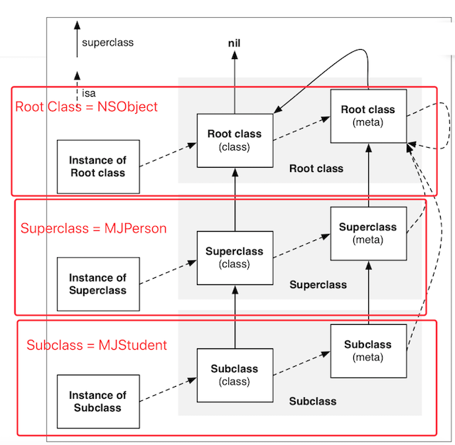

# isa和superclass


## isa指针

- instance的isa指向class
  - 当调用对象方法时，通过instance的isa找到class，最后找到对象方法的实现进行调用
- class的isa指向meta-class
  - 当调用类方法时，通过class的isa找到meta-class，最后找到类方法的实现进行调用

### 从64bit开始，isa需要进行一次位运算，才能计算出真实地址
```objc
# if __arm64__
#    define ISA_MASK 0x0000000ffffffff8ULL
# elif __x86_64__
#    define ISA_MASK 0x00007ffffffffff8ULL
# endif
```
⚠️：superclass指针不需要位运算，直接就是真实的地址

## class对象的superclass指针
- 当Student的class要调用Person的类方法时，会先通过isa找到Student的meta-class，然后通过superclass找到Person的meta-class，最后找到类方法的实现进行调用


## meta-class对象的superclass指针
- 当Student的class要调用Person的类方法时，会先通过isa找到Student的meta-class，然后通过superclass找到Person的meta-class，最后找到类方法的实现进行调用


## 总结
### isa指针指向哪里
- instance对象的isa指向class对象
- class对象的isa指向meta-class对象
- meta-class对象的isa指向基类的meta-class对象  


⚠️：可以根据顶部的图查看
### superclass指向哪里
- class的superclass指向父类的class
  - 如果没有父类，superclass指针为nil
- meta-class的superclass指向父类的meta-class
  - 基类的meta-class的superclass指向基类的class

### 方法调用轨迹
- instance调用对象方法的轨迹
  - isa找到class，方法不存在，就通过superclass找父类

- class调用类方法的轨迹
  - isa找meta-class，方法不存在，就通过superclass找父类

## objc4源码下载
https://opensource.apple.com/tarballs/objc4/

class、meta-class对象的本质结构都是struct objc_class

## 窥探struct objc_class的结构


### objc_class的结构（仿写） 
```objc
#import "MJClassInfo.h"

// 修改.m->.mm(编译MJClassInfo的C++文件)

mj_objc_class *studentClass = (__bridge mj_objc_class *)([MJStudent class]);
mj_objc_class *personClass = (__bridge mj_objc_class *)([MJPerson class]);

class_rw_t *studentClassData = studentClass->data();
class_rw_t *personClassData = personClass->data();

class_rw_t *studentMetaClassData = studentClass->metaClass()->data();
class_rw_t *personMetaClassData = personClass->metaClass()->data();
```
- 文件目录:./iOS/Static/files/MJClassInfo.h
- OC 文件直接改成.mm文件(.m->.mm)即可编译C++文件   

## 面试题
- 一个NSObject对象占用多少内存？
  - 系统分配了16个字节给NSObject对象（通过malloc_size函数获得）
  - 但NSObject对象内部只使用了8个字节的空间（64bit环境下，可以通过class_getInstanceSize函数获得）
- 对象的isa指针指向哪里？
  - instance对象的isa指向class对象
  - class对象的isa指向meta-class对象
  - meta-class对象的isa指向基类的meta-class对象
- OC的类信息存放在哪里？
  - 对象方法、属性、成员变量、协议信息，存放在class对象中
  - 类方法，存放在meta-class对象中
  - 成员变量的具体值，存放在instance对象


